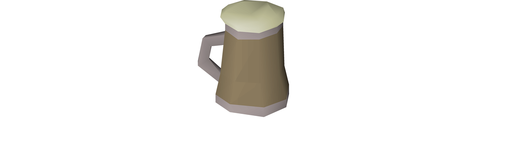
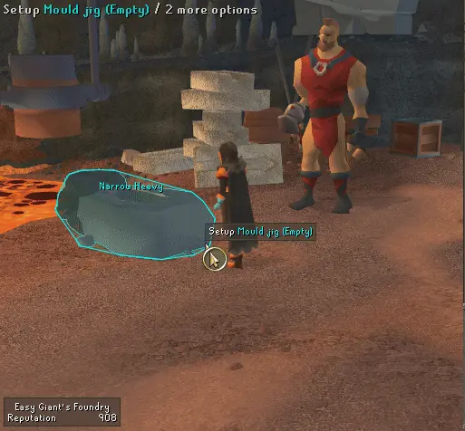
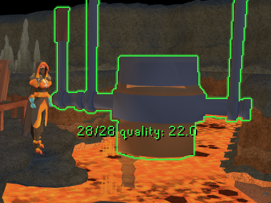
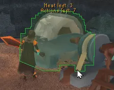
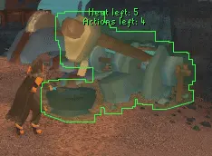
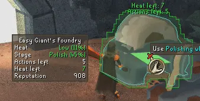

  <picture>
    <source media="(prefers-color-scheme: light)" srcset="./banner_black.png">
    
  </picture>

---
The "Easy Giants' Foundry" plugin is designed to optimize your performance in the Giants' Foundry.

# Features Overview
- **Interactive Elements and NPCs**
  - Highlights **Kovac, Crucible, and Mould Jig** when relevant, drawing your attention to key NPCs and equipment.
  - Alerts you when the **waterfall/lava pool** can be used to correct temperature discrepancies.
  - Uses **customizable status colors** to highlight relevant tools, helping you maintain the right temperature:
    * **Red:** Wrong temperature
    * **Green:** Right temperature
    * **Orange:** One action or temperature change remaining
    * **Cyan:** Click tool again for bonus progress
- **Alloy Quality and Crucible Content**
  - Overlays **current crucible contents** and the **quality of the alloy** being forged.
- **Best Mould Guidance**
  - Highlights the **best moulds to use** for your current task, guiding your selection process.
- **Progress and Actions Tracking**
  - Displays the **number of lava/waterfall actions** needed to complete the current stage.
  - Shows the **number of actions required** to complete the next stage.
  - Indicates the **number of actions** before gaining or losing too much heat.
  - Tracks **heat and progress** as percentages.

# Pictures
Best Mould             |  Crucible Alloy Quality
:-------------------------:|:-------------------------:
|

Heating/Cooling Prediction  |  Low/High Heat Warning
:-------------------------:|:-------------------------:
|

Bonus Click Notification |  Information Panel
:-------------------------:|:-------------------------:
|

## Contributors

- [Patrick](https://github.com/pwatts6060 "Patrick's github")
    * Best moulds interface feature
    * Highlight relevant tools with status colors
    * Kovac, Crucible, and Mould Jig highlights
    * Highlight waterfall/lava pool when temperature is wrong
    * Added Bonus sound/notifications
    * Added overlay configs
    * Added info panel configs
    * Added color configuration
- [Vanillj](https://github.com/Vanillj "Vanillj's github")
  * Added config
  * Added notifications for heat/stage changes
  * Added config for actions/heat left for notifications
- [Louis Hong](https://github.com/TheLouisHong "Louis Hongs' github")
  * Added crucible content and alloy quality calculation and overlay
  * Added tools action/heat status overlay
  * Added lava/waterfall action prediction and overlay
  * Added border highlighting

